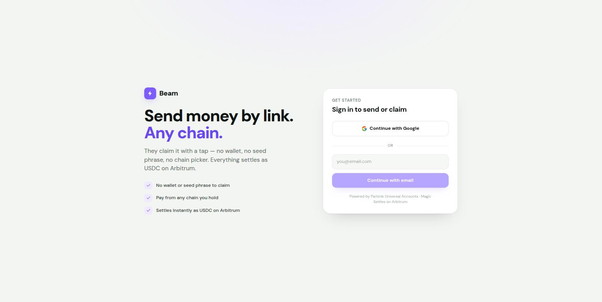
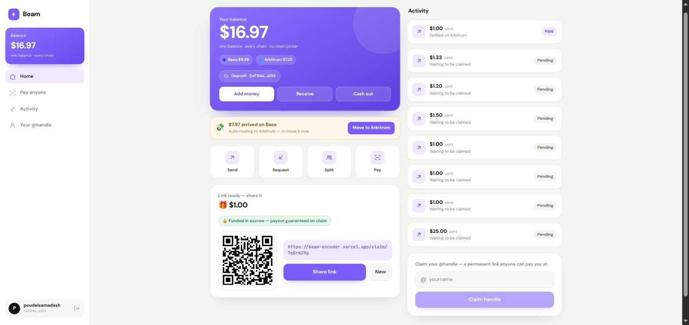
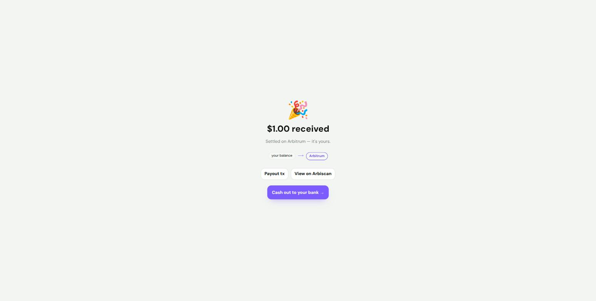
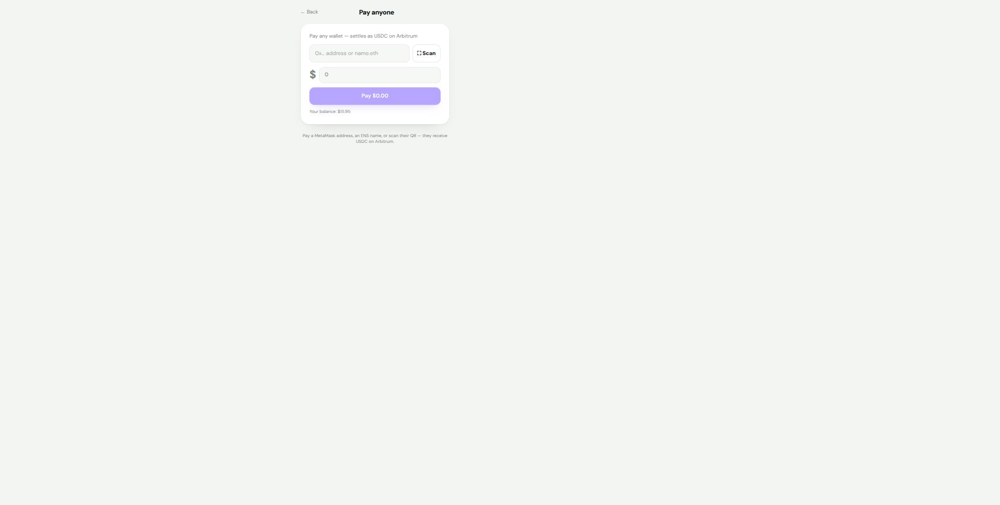
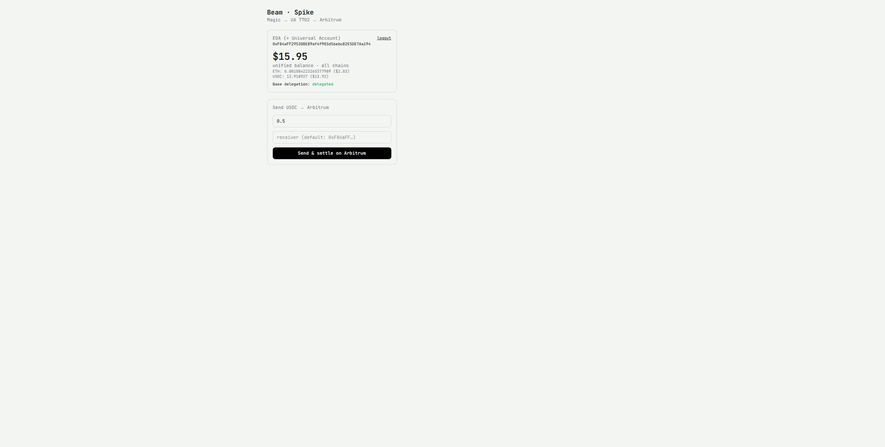

# Beam — Send money by link. Any chain. They claim it with Google.

**uxmaxx hackathon submission** (Encode Club × Particle Network)

| | |
|---|---|
| **Live demo** | https://beam-encoder.vercel.app |
| **Repository** | https://github.com/0x-pankaj/Beam |
| **Demo video** | _<add link>_ |
| **Settlement** | Arbitrum One (42161), native USDC |
| **Stack** | Next.js 16 · React 19 · Particle Universal Accounts SDK (EIP-7702) · Magic embedded wallet · Arbitrum · Vercel |

Beam is a Cash-App-style consumer payments app for crypto that makes the crypto **invisible**. A sender pays from whatever they hold on whatever chain; the recipient — who may have **no wallet at all** — claims with a Google login. Everything settles as native USDC on Arbitrum.

---

## Tracks

| Track | Why Beam qualifies |
|---|---|
| **Universal Accounts Track (Particle Network)** — primary | Particle UA in **EIP-7702 mode** is the spine of the app, not a bolt-on: unified USD balance, cross-chain liquidity routing, in-place EOA upgrade. Beam aims UA at a use case where it is *necessary*, not just convenient: **the recipient doesn't have a wallet yet.** |
| **General Track (Particle Network)** | Fully functional consumer payments product built on Particle's stack, deployed and demoable end-to-end with real mainnet value. |
| **Magic Labs bonus challenge** | Magic is the identity + signer layer for **every** user: Google/email login creates the EOA, `sign7702Authorization` / `send7702Transaction` power the Type-4 upgrade. Walletless onboarding isn't a feature of Beam — it's the premise. |
| **Arbitrum bounty** | Arbitrum is the **real settlement layer**: every claim pays out native USDC on Arbitrum One with a verifiable Arbiscan tx; escrow deposits are verified against real Arbitrum state; per-campaign escrow addresses live on Arbitrum. |

---

## Proof it works — a real transaction from today

This is not a mock. On submission day we ran the full hero flow on **mainnet** with real USDC:

| Artifact | Value |
|---|---|
| Sender (Google account → Magic EOA → UA 7702) | `0xF84aFF295308E89af4f903d56ebcB2E5DE7Aa194` |
| Sender's EIP-7702 delegation (on-chain code) | `0xef01006640c1cccaf07dbe765ec05e294fe427cc92831c` (Base **and** Arbitrum) |
| Link | `https://beam-encoder.vercel.app/claim/7e0r629g` — $1.00, "gift" |
| Recipient (different Google account, **no wallet before claiming**) | `0x3fD2Ba214D6B5d2640cb799AB536103636192D7d` |
| Payout tx (USDC on Arbitrum One) | [`0x30f95ecea705446ab86dbacb9dc0e7b82eb4c5d2773a11622ada88d104deef6b`](https://arbiscan.io/tx/0x30f95ecea705446ab86dbacb9dc0e7b82eb4c5d2773a11622ada88d104deef6b) |
| Created → funded in escrow → claimed → paid | **43 seconds** end to end |

The sender never chose a chain, never saw gas, never signed a raw transaction. The recipient logged in with Google and money appeared, with an Arbiscan link to prove it.

---

## Screenshots

**Landing / login** — Google-first, walletless language. "Powered by Particle Universal Accounts · Magic · Settles on Arbitrum."



**Dashboard** — one USD balance aggregated across chains (Base + Arbitrum shown), Send/Request/Split/Pay, live activity feed, escrow-funded link with QR ready to share.



**Claim page (recipient)** — "$1.00 received — Settled on Arbitrum," with *Payout tx* and *View on Arbiscan*, plus one-tap fiat cash-out.



**Pay anyone** — pay a raw address, an ENS name, or scan a QR; they receive USDC on Arbitrum regardless of where the payer's funds live.



**/spike** — the transparent tech-proof page: Magic EOA = Universal Account, unified balance, live 7702 delegation status.



---

## Deep dive 1 — Particle Universal Accounts (EIP-7702 mode)

**Where:** `src/providers/UniversalAccountProvider.tsx`, `src/lib/chains.ts`, `spike/ua-arbitrum.ts`

UA is initialized in **EIP-7702 mode** with the Magic EOA as owner — the user's address *is* the smart account; no second address, no asset migration:

```ts
new UniversalAccount({
  projectId, projectClientKey, projectAppUuid,
  smartAccountOptions: {
    useEIP7702: true,
    name: "UNIVERSAL",
    version: UNIVERSAL_ACCOUNT_VERSION,
    ownerAddress,            // ← the Magic EOA
  },
  tradeConfig: { slippageBps: 100, universalGas: false },
});
```

**How Beam uses it (all in the product, all demoable):**

- **Unified balance** — `getPrimaryAssets()` renders the single USD number *and* the per-chain chips (Base $9.96 · Arbitrum $7.01) that make chain abstraction *visible* to a judge without a wallet lecture.
- **Cross-chain transfer that settles on Arbitrum** — `createTransferTransaction({ token: { chainId: 42161, address: USDC }, amount, receiver })`; the SDK sources liquidity from whatever primary assets the user holds anywhere. The sender signs one `rootHash` message via Magic. This funds link escrow, direct claims, and "Pay anyone."
- **EIP-7702 delegation lifecycle** — `getEIP7702Deployments()` drives per-chain delegation status; the app **pre-delegates with a concrete Type-4 transaction** and rebuilds transfers when the SDK requests a chain-agnostic authorization (see war stories below — this is a real integration depth marker).
- **Deposit sweep / auto-routing** — inbound USDC on any chain (someone pays your Receive QR from Base) is detected as `offArbitrumUsdc` and consolidated onto Arbitrum with a one-tap (or automatic) UA self-transfer — chain abstraction applied to *receiving*, not just sending.
- **Fiat on/off ramp** — Particle Ramp wired to "Add money" and "Cash out," so a recipient can exit to their bank without ever learning the word "bridge."

**Why this is an *innovative + prominent* use of UA:** every generic team demos "one balance, many chains" for a user who already has a wallet. Beam points UA at the moment a **new user with no wallet** receives money: UA is what lets value from any chain land as clean USDC on one chain for an address that didn't exist a minute ago. Chain abstraction isn't the feature — it's the enabler of a product a non-crypto person can use.

---

## Deep dive 2 — Magic (walletless identity + 7702 signer)

**Where:** `src/providers/MagicProvider.tsx`, `src/lib/gsi.ts`

- **Login** — Google (One Tap + OAuth via `@magic-ext/oauth2`) as the primary CTA with email OTP fallback. No seed phrase, no extension, no "connect wallet" anywhere in the product's language.
- **The EOA** — Magic's embedded wallet issues the key; the address doubles as the Universal Account (7702). The recipient's wallet is *created by logging in* — that's the entire onboarding.
- **The 7702 signer** — Beam uses Magic's EVM extension end-to-end for the upgrade path:
  - `magic.wallet.sign7702Authorization({ contractAddress, chainId, nonce })` → signs the EIP-7702 authorization (returns `{r,s,v}`, serialized via ethers `Signature.from`).
  - `magic.wallet.send7702Transaction({ to, data, authorizationList })` → broadcasts the **Type-4** delegation transaction itself.
  - `magic.evm.switchChain(chainId)` → multi-network EVM extension (Base, Arbitrum, Ethereum registered) so delegation can run on whichever chain the transfer requires.
- **Session UX** — optimistic session restore (no login-page flash on refresh), silent re-auth via `user.isLoggedIn()`.

Magic isn't a login checkbox here — it is the answer to the hackathon's hardest UX question: *how does a person with zero crypto receive crypto in under 30 seconds?*

---

## Deep dive 3 — Arbitrum (the settlement layer)

**Where:** `src/lib/relayer.ts`, `src/lib/arbitrum.ts`, `src/lib/settle.ts`, all `/api/links/[id]/*` routes

Everything of value in Beam ends as **native USDC on Arbitrum One** (`0xaf88d065e77c8cC2239327C5EDb3A432268e5831`):

- **Escrow-guaranteed send links.** Creating a send link moves the sender's funds *now* — the UA deposits USDC into Beam's escrow wallet on Arbitrum. The link only flips to `funded` after the server **verifies the escrow's real on-chain USDC balance** against a reserved-amount ledger (atomic Redis reconciliation). The recipient is guaranteed payment even if the sender goes offline forever.
- **Real payouts.** On claim, the escrow relayer pays the recipient USDC on Arbitrum in a normal ERC-20 transfer — a **real tx hash** the UI links to Arbiscan (see the proof table above).
- **Verified campaign totals with zero contracts.** Each Split/Fundraiser/Product link gets its own deposit address derived deterministically from the relayer key (`keccak256(key + ":campaign:" + linkId)`). "Raised so far" is that address's *actual on-chain USDC balance* — not self-reported state. Sweeps to the creator gas-fund the derived child from the master wallet. On-chain-verifiable totals, no Solidity deployed, no per-campaign config.
- **Trust boundary on-chain.** `/paid` and `/contribute` refuse to mark anything paid until the money is visible in Arbitrum state; used tx-ids are single-use (replay protection); refund/collect require a fresh signature from the link creator's EOA.

Arbitrum was chosen deliberately: cheap enough that $1 links make sense, fast enough that "created → paid" fits inside a 43-second demo, and liquid enough to be UA's settlement target.

---

## Architecture

```
┌────────────────────────────────────────────────────────────────────┐
│                     Next.js 16 app (Vercel)                        │
│                                                                    │
│  UI (React 19, Tailwind v4, PWA)                                   │
│   ├─ MagicProvider      Google/email login → EOA, 7702 signing     │
│   ├─ UAProvider         Particle UA (EIP-7702) — balance, routing, │
│   │                     delegation lifecycle, deposit sweep        │
│   └─ pages: dashboard · claim/[id] · pay · u/[handle] · spike      │
│                                                                    │
│  API routes (App Router)                                           │
│   ├─ /api/links*        create/fund/claim/refund/collect/…        │
│   │    per-link locks (SET NX EX) · rate limits · sig auth         │
│   ├─ escrow relayer     on-chain verify + USDC payouts (ethers)    │
│   └─ /api/health        production-gap self-check                  │
│                                                                    │
│  Store: Upstash Redis / Vercel KV (in-memory fallback for dev)     │
└────────────────────────────────────────────────────────────────────┘
        │                        │                        │
   Magic (identity,       Particle UA (chain          Arbitrum One
   EOA + 7702 signer)     abstraction, liquidity)     (settlement, escrow,
                                                       payouts, Arbiscan)
```

**Link state machine (send/escrow):** `pending → funded → sending → paid`, plus `refunded` / `expired`. Funds lock at create-time; claim pays out from escrow; unclaimed links are reclaimable by the sender (signature-gated).

---

## Beyond the hero flow — the full product

- **Request links** — "you owe me $X" links paid peer-to-peer into the requester's UA.
- **Split** — group bills with per-payer tracking and verified totals; auto-closes and auto-sweeps at target.
- **Fundraiser & Sell** — campaign/product links with on-chain-verified raised amounts and creator `collect`.
- **Pay anyone** — raw address, **ENS name**, or QR scan; settles as USDC on Arbitrum.
- **@handles** — `beam…/u/yourname`, a permanent pay-me page with Open Graph/Twitter link previews.
- **Receive** — QR + address for direct deposits from any wallet on any chain, with auto-sweep to Arbitrum.
- **Fiat both ways** — add money / cash out via Particle Ramp.
- **Email notifications** — optional "email the link to them" via Resend.
- **Soft link expiry** with reclaim nudges; **activity feed** live on both sides of every payment.
- **Installable PWA**, mobile-first fintech UI, success animations, dark theme.

---

## Trust & security hardening (what's under the polish)

- **Nothing money-moving trusts the client.** Escrow funding and campaign totals are verified against real Arbitrum state before any status flips.
- **Per-link distributed locks** (`SET NX EX`) serialize claim/refund/contribute/collect — double-payout race closed.
- **Signature-gated authority** — refund/collect require a fresh message signature from the creator's EOA with a 10-minute window.
- **Replay protection** — payment tx-ids are burn-once (with rollback if verification fails).
- **Redis-backed rate limits** shared across serverless instances.
- **Production refuses to degrade** — with `NODE_ENV=production`, money routes 503 unless Redis + relayer are configured; `/api/health` reports any `productionGap`. Money routes export `maxDuration = 60` for on-chain polling.

**Honest trade-off, stated plainly:** escrow funds are custodial *while in flight* (a server-held hot wallet). Right call for a hackathon — guaranteed payouts with zero contract risk surface; the roadmap successor is an on-chain escrow contract.

---

## Engineering war stories (real integration depth, all discovered the hard way)

1. **UA cross-chain is mainnet-only.** No testnets — Primary Asset liquidity only exists on mainnets. The entire demo runs on real money in tiny amounts; the plan was rebuilt around this on day one.
2. **Magic cannot sign chain-agnostic (chainId 0) EIP-7702 authorizations.** The UA SDK's inline delegation asks for exactly that, and signing it with a concrete chainId fails at the bundler with `AA24 signature error`. Beam's fix: detect userOps demanding chain-agnostic auth, **pre-delegate that chain with a real Type-4 transaction** (`ensureDelegated(chainId)`), wait for Particle's backend to observe it, then rebuild the transfer. This is now automatic in the send path — any fresh account self-heals.
3. **Magic's EVM extension rejects `switchChain` to unregistered networks** (`-32602`). Every chain the delegation path can touch (Base, Arbitrum, Ethereum) is registered up front.
4. **UA gives no destination tx hash** (`sendTransaction` returns a UniversalX `transactionId`). So escrow funding is verified by **on-chain balance reconciliation** against a reserved ledger instead of receipt-watching — sturdier than it sounds, and it's what makes "funded" trustworthy.
5. **`getPrimaryAssets()` vs docs, SDK types, Turbopack SSR enum quirks** — the SDK's `CHAIN_ID` enum resolves to `undefined` in the server bundle; chain ids are plain literals in `src/lib/chains.ts`. `package.json` exports lacked a `types` condition; mapped via tsconfig `paths`.
6. **Delegation ≠ spendable immediately at quote-time; un-delegated EOA funds are visible but unroutable.** The dashboard shows the full unified balance while the delegation lifecycle catches up — handled in UX copy ("setting up your account") instead of error dumps.

---

## Run it locally

```bash
git clone https://github.com/0x-pankaj/Beam && cd Beam
pnpm install
cp .env.example .env.local   # fill in Particle + Magic keys (see the template's comments)
pnpm dev
```

| Env | Purpose |
|---|---|
| `NEXT_PUBLIC_PARTICLE_*` | Particle UA project credentials (dashboard.particle.network) |
| `NEXT_PUBLIC_MAGIC_API_KEY` | Magic publishable key (Google + email login) |
| `NEXT_PUBLIC_GOOGLE_CLIENT_ID` | Google One Tap (optional — email fallback without it) |
| `UPSTASH_REDIS_*` / `KV_REST_API_*` | Persistent link store (optional locally, required in prod) |
| `BEAM_RELAYER_PRIVATE_KEY` | Escrow hot wallet (server-only; without it, send links fall back to sender-pays-on-claim) |

`pnpm spike` runs the headless proof (`spike/ua-arbitrum.ts`): throwaway EOA → UA 7702 → unified balance → cross-chain transfer settling on Arbitrum, no browser involved.

> **Note:** UA liquidity is mainnet-only, so any live run moves real (tiny) USDC. `GET /api/health` self-checks a deployment (`persistentStore`, `escrowRelayer`, `productionGap`).

---

## Demo-day notes

- Amounts are intentionally tiny (~$1) because everything is real mainnet value.
- If Particle's cross-chain solver is under maintenance (it surfaced `-32653` / a "system maintenance" notice during our rehearsal window), Beam still demos fully: funds already on Arbitrum settle same-chain through the identical escrow → claim → payout pipeline, and the unified balance still shows multi-chain aggregation. The cross-chain hop re-enables itself the moment Particle's routing returns — no code changes needed.

## Roadmap

- On-chain escrow contract (remove the custodial-in-flight window)
- Gas-sponsored claims; "no gas token needed" messaging end-to-end
- Social handles + contacts; request feeds
- AI "type what you want to pay" natural-language composer

---

*Built solo in ~3 weeks for uxmaxx. Every screenshot above is the deployed product; every hash above is on Arbitrum mainnet.*
